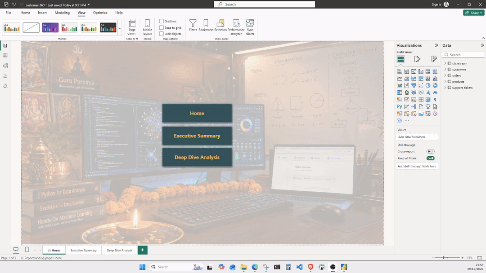
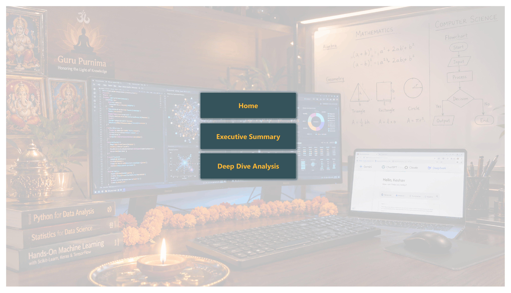
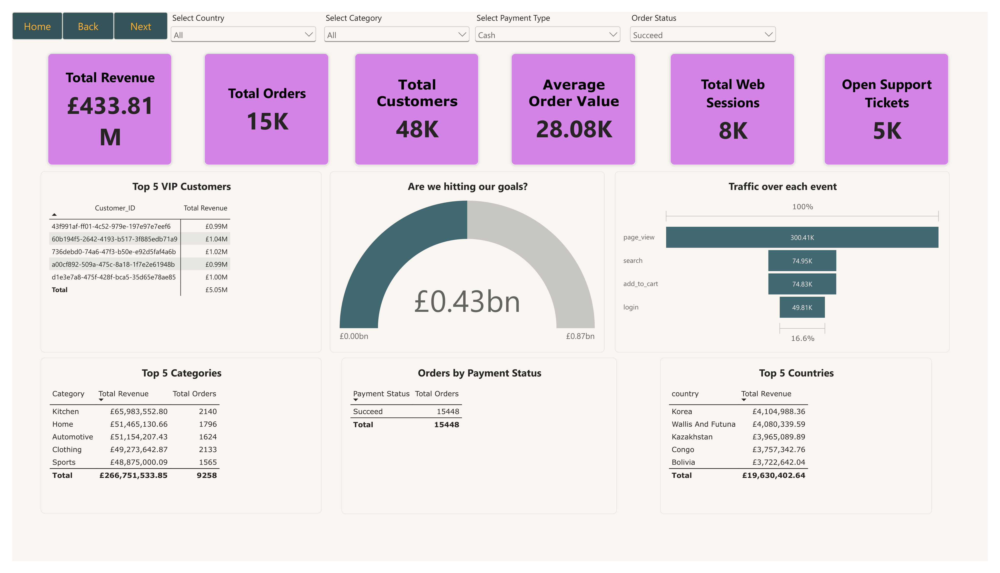
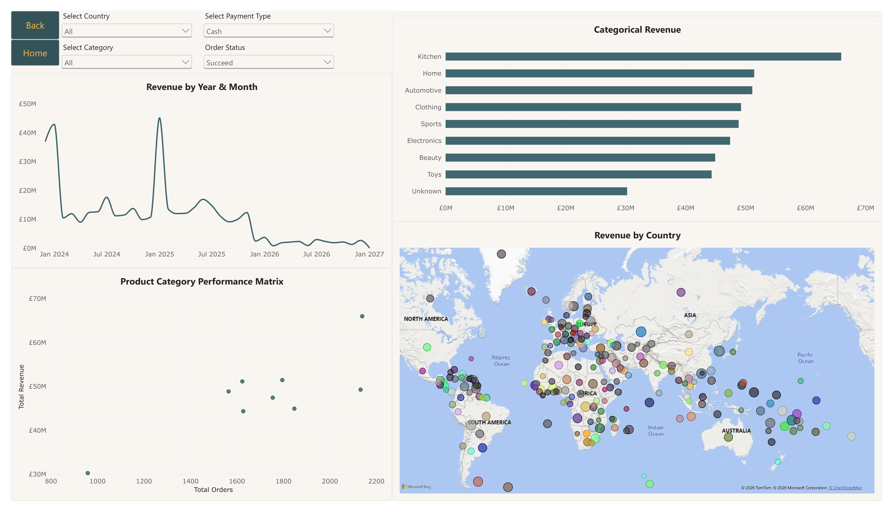

# Customer 360 - Advanced SQL Analytics & Power BI Dashboard

> **End-to-End Data Engineering & BI Project: Building a Customer 360 ETL pipeline, answering 30 complex business queries using advanced PostgreSQL, and visualizing insights in an interactive Power BI application.**

## 📌 Project Overview
The Customer 360 project is a comprehensive SQL-based analytics solution designed to extract, clean, and analyze complex e-commerce and web traffic data. Moving beyond basic aggregations, this project utilizes advanced PostgreSQL techniques to build a robust ETL pipeline and solve real-world operational challenges. Key achievements include standardizing dirty datasets using Regex, tracking consecutive purchase streaks (Gaps & Islands), and calculating Month-over-Month (MoM) revenue growth. The backend data model powers a 3-page interactive Power BI executive dashboard.

---

## 📊 Power BI Executive Dashboard
The cleaned relational database was imported into Power BI to create an interactive, multi-tier Customer 360 application featuring executive KPIs, trend analysis, and geographic mapping.

**Dashboard Interactive Demo:**
*(Below is a screen recording demonstrating the interactive cross-filtering and page navigation of the dashboard)*

### 1. Home Page / Navigation
A sleek landing page utilizing custom button navigation to guide stakeholders through the data story.

### 2. Executive Summary
A high-level overview featuring core KPIs (Total Revenue, Total Orders, Total Customers), a Conversion Funnel, a dynamic VIP Customer Leaderboard, and an interactive Country slicer.

### 3. Deep Dive Analysis
A granular analytical view utilizing an AI Decomposition Tree for root-cause revenue analysis and a Product Category Performance Matrix (Scatter Plot) to segment catalog performance by value and frequency.

---

## 💾 Data Source
The raw data for this project is sourced from Kaggle:
* **Dataset:** [Customer 360 Dataset by Vinay Kandimalla](https://www.kaggle.com/datasets/vinaykandimalla/customer-360/data)

*(Note: To keep this repository lightweight and adhere to version control best practices, the heavy ~120MB raw `.csv` files are ignored via `.gitignore`. Follow the reproduction steps below to run the code locally).*

---

## 🗂️ Repository Structure
The core logic of the project is broken into modular scripts and structured directories:

* **`/power-bi`**: Contains the `.pbix` dashboard file and the `/images` directory for documentation assets.
* **`/sql`**: Contains the SQL pipeline scripts:
  * `raw_file_schema_creation.sql`: Establishes the `staging` and `analytics` schemas and defines the raw table structures.
  * `cleaning_to_import_data.sql`: Exploratory Data Analysis (EDA) queries to identify orphan records and parse malformed text.
  * `cleaned_analytics_tables.sql`: The ETL pipeline that sanitizes data using Regex, standardizes timestamps, and enforces Primary/Foreign Key constraints.
  * `real_world_questions_answers.sql`: The master script containing 30 advanced business queries (including CTE chaining and window functions).

---

## 🛠️ Key Technical Skills Demonstrated

### Data Engineering & SQL
* **Data Hygiene & Regex:** Sanitized financial metrics by removing alphabetic characters from amounts (`order_amount !~ '^[0-9\.]+$'`). Standardized text fields using `INITCAP()` and `TRIM()`.
* **Advanced Date Parsing:** Safely converted various, inconsistent string date formats (e.g., `YYYY-MM-DD"T"HH24:MI:SS.US`) into strictly typed timestamps.
* **Relational Integrity:** Enforced database architecture by resolving duplicate IDs and establishing foreign keys linking orders and support tickets to the primary customer table.
* **Advanced Window Functions:** 
  * **Sessionization:** Grouped raw web clicks into logical browsing sessions based on a 60-minute inactivity threshold (`LAG`).
  * **Gaps & Islands:** Identified user purchase streaks by subtracting `DENSE_RANK()` values from chronological order dates.
  * **Moving Averages:** Evaluated support agent performance using a moving average defined by `ROWS BETWEEN 2 PRECEDING AND CURRENT ROW`.
  * **VIP Stratification:** Segmented customers into quartiles using `NTILE(4)` based on lifetime successful spend.

### Business Intelligence (Power BI)
* **Data Modeling:** Constructed a robust relational model enforcing 1-to-Many relationships with Single cross-filter directions to optimize performance.
* **DAX Formulation:** Authored dynamic measures using `SUM`, `DIVIDE`, `CALCULATE`, and `ISBLANK` to drive executive KPI cards.
* **UX/UI Design:** Developed a multi-page app experience utilizing page navigation actions, synchronized slicers, and custom visual formatting.

---

## 🚀 How to Reproduce This Project
To recreate this database and run the analysis locally, follow these steps:

**1. Get the Data**
* Download the raw `.csv` files from the [Kaggle dataset link](https://www.kaggle.com/datasets/vinaykandimalla/customer-360/data).

**2. Setup the Database**
* Run `sql/raw_file_schema_creation.sql` in PostgreSQL to build the empty `staging` and `analytics` schemas.

**3. Import the Raw Data**
* Import the downloaded `.csv` files into their respective `staging` tables. 

**4. Run the ETL Pipeline**
* Execute `sql/cleaned_analytics_tables.sql`. This script will clean the messy staging data, parse dates/currencies, apply constraints, and populate the final `analytics` schema.

**5. Execute Business Analytics**
* Run `sql/real_world_questions_answers.sql` to view the solutions to the 30 scenario-based business questions.

**6. View the Dashboard**
* Open the `.pbix` file located in the `/power-bi` folder using Power BI Desktop to interact with the visualizations.

---

## 🗺️ Future Roadmap
* [ ] **Data Orchestration:** Convert the manual SQL scripts into a `dbt` (Data Build Tool) project to automate the transformation pipeline.
* [ ] **Machine Learning (Python):** Connect to the cleaned database via Jupyter Notebooks to build a Customer Churn Prediction model using Scikit-Learn or perform K-Means Customer Segmentation.